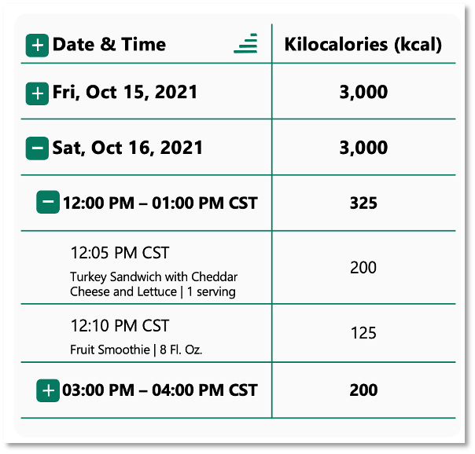
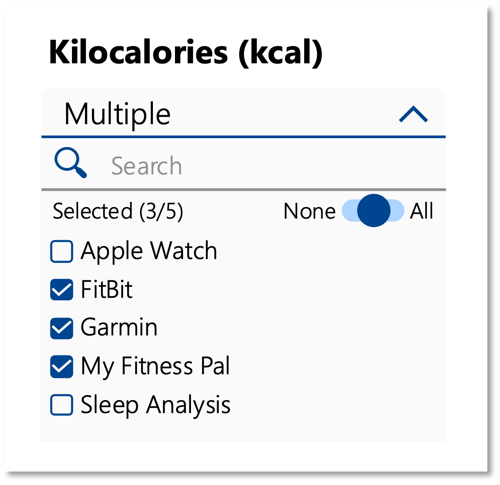
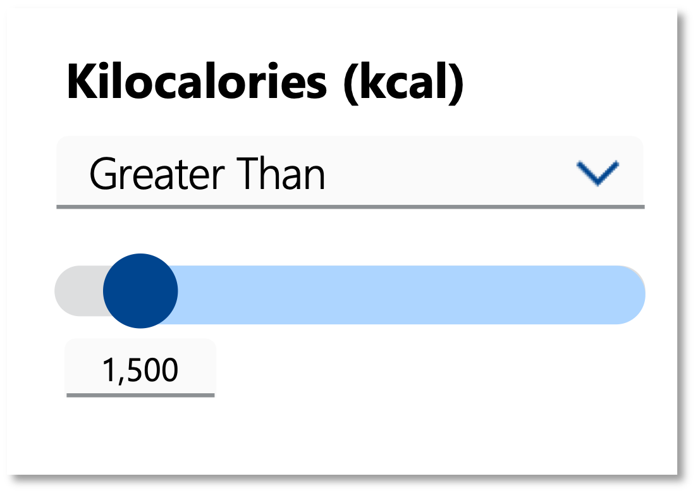
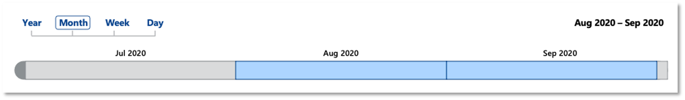

# Project Scope of Work

## Description
Build 2 visuals from scratch and modify / update 2 visuals using the PowerBI visual API. These visuals need to be dynamic and follow all PowerBI standards.

**PowerBI Documentation:** https://docs.microsoft.com/en-us/power-bi/developer/visuals/develop-power-bi-visuals

## Key Visuals:

**Visuals to Build:**

1. [Matrix](https://github.com/TriskeleTechnology/Project-CustomPowerBIVisuals/blob/main/README.md#matrix)
2. [Selection Filter](https://github.com/TriskeleTechnology/Project-CustomPowerBIVisuals/main/README.md#selection-filter)

**Visuals to Update:**

3. [Slider Filter](https://github.com/TriskeleTechnology/Project-CustomPowerBIVisuals/main/README.md#slider-filter)
4. [Timeline Filter](https://github.com/TriskeleTechnology/Project-CustomPowerBIVisuals/main/README.md#timeline-filter)

**Overall Scope Document:** [Link](CustomTypeScriptVisuals_ScopeofWork.pdf) 

---

## Matrix 

Build a custom Matrix that allows a user on a PowerBI report to view and select individual data points.

  

**Specification Document:** [Link](Matrix.pdf)

## Selection Filter

Build a custom Selection Filter that allows a user on a PowerBI report to filter the data based on the items selected in the visual.

  

**Specification Document:** [Link](SelectionFilter.pdf)

## Slider Filter

Modify / update a custom Slider Filter that allows a user on a PowerBI report to filter the data based on the values selected in the visual.

  

**Related Code to Merge and Update:**
- https://github.com/TriskeleTechnology/SliderFilter
- https://github.com/TriskeleTechnology/SliderFilter_Grouping

**Specification Document:** [Link](SliderFilter.pdf)

## Timeline Filter

Modify / update a custom Timeline Filter that allows a user on a PowerBI report to filter the date based on the dates selected in the visual.

  

**Related Code to Update:** 
- https://github.com/TriskeleTechnology/TimelineFilter

**Specification Document:** [Link](TimelineFilter.pdf)

